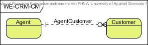
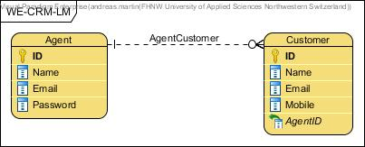
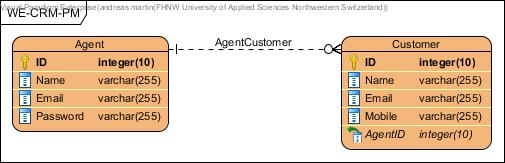

# Data Modeling

This is a data-modelling reference project elaborated by the students step-by-step in the FHNW Information Systems Introduction lecture.

## Conceptual Data Model


## Logical Data Model


## Physical Data Model


```SQL
CREATE TABLE Agent (
  ID       INTEGER NOT NULL PRIMARY KEY, 
  Name     varchar(255) NOT NULL, 
  Email    varchar(255) NOT NULL, 
  Password varchar(255) NOT NULL);
CREATE TABLE Customer (
  ID      INTEGER NOT NULL PRIMARY KEY, 
  Name    varchar(255) NOT NULL, 
  Email   varchar(255) NOT NULL, 
  Mobile  varchar(255) NOT NULL, 
  AgentID integer(10) NOT NULL, 
FOREIGN KEY(AgentID) REFERENCES Agent(ID));
```

## Maintainer

- [Andreas Martin](https://github.com/andreasmartin)

## License

- [Apache License, Version 2.0](LICENSE)
